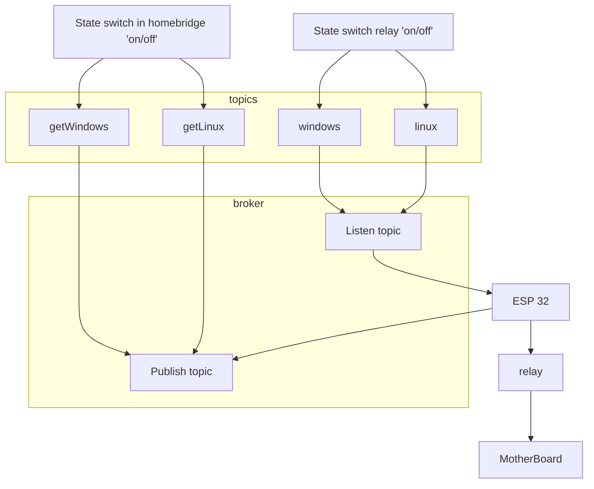

# TODO

Si windows ou linux allumer
	Alors ne pas allumer le bouton -- OK mais si allumer a distance pas avec le ping --> topic : "topic/power" pour l'etat de l'ordinateur depuis le nas sur le resole hostname
		Ne fonctionne pas avec la variable POWER ! Trouver un moyen de faire autrement ! reset a l'ancien etat

Dans dual-boot:
Si windows est allume et on veux allumer linux.
	Alors reboot
Si Linux est allume et on veux windows
	Alors envoyer grub2 et reboot

# Plan

# Requirements

- secret.hpp a la racine avec des definitions de :  
Configuration Wi-fi  
	- WIFI_SSID  
	- WIFI_PASSWORD  
Configuration ota  
	- WWW_USERNAME  
	- WWW_PASS  
Configuration du server MQTT  
	- MQTT_SERVER  
	- MQTT_PORT  
	- MQTT_USERNAME  
	- MQTT_PASSWORD  

- Trouver l'adresse ip de l'esp-32 puis se connecter a ip/update pour les future mise a jour  

